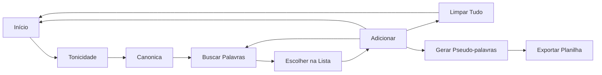

# Gerador de Pseudo-palavras

Esta ferramenta, desenvolvida como parte do processo de seleção do CAEd, é um facilitador na geração de pseudo-palavras na língua portuguesa.
Pseudo palavras são importantes em auxiliar a avaliação de alfabetização de alunos.
A ferramenta pode ser acessada [aqui](http://142.93.15.216:8501/caed/).

# Banco de Palavras

A primeira parte do trabalho envolve a construção de um banco de palavras com tamanho expressivo.

 1. Primeiramente foi desenvolvido um crawler que recupera palavras do site [portaldalinguaportuguesa.org](http://www.portaldalinguaportuguesa.org/).
 2. Da letra 'a' até 'z' foram recolhidas as palavras de 500 páginas em cada letra. Cada página contém 20 palavras.
 3. Palavras idênticas entre sua escrita, divisão silábica e tonicidade foram agregadas. Um exemplo é a palavra *abacate* que aparece três vezes, como adjetivo, como substantivo masculino e feminino.
 4. Criado um arquivo **.json** com as palavras estruturadas como
 

    `{
	    "word":"zabumba",
	    "syllables":["za","bum","ba"],
	    "tonic":1, # posição 1 do vetor syllables
	    "class":"paroxítona",
	    "canonic":false
  }`

A implementação é feita em Python e utiliza as bibliotecas **requests** e **BeautifulSoup** para fazer os requests e extrair informações do resultado respectivamente. Dessa forma, obtemos do site a palavra, separação das sílabas e a sílaba tônica, e então podemos classificar por tonicidade e se ela é canônica.

## Streamlit

A ferramenta principal se alimenta do **.json** criado anteriormente. Ela é desenvolvida utilizando o framework [Streamlit](https://www.streamlit.io/).
O *Streamlit* é um framework para confecção de apps amplamente utilizado para visualização de dados. Ele é open-source e totalmente em Python (na verdade, é possível mesclar outras ferramentas/linguagens se necessário), além de dar velocidade na criação dessas visualizações por sua simplicidade.

## Gerador

O [gerador](http://142.93.15.216:8501/caed/) desenvolvido com Streamlit contém uma página informativa e outra que lhe permite customizar as palavras desejadas, adicioná-las em uma fila. Após selecionar todas as desejadas, uma lista de pseudo-palavras baseadas nas selecionadas é criada e pode ser exportada como planilha.

Um simples [fluxograma](https://mermaid-js.github.io/mermaid-live-editor/#/view/eyJjb2RlIjoiZ3JhcGggVERcbm9bSW7DrWNpb10gLS0-IEFcbkFbVG9uaWNpZGFkZV0gLS0-IEJbQ2Fub25pY2FdXG5CIC0tPiBDW0J1c2NhciBQYWxhdnJhc11cbkMgLS0-IERbRXNjb2xoZXIgbmEgTGlzdGFdXG5EIC0tPiBFW0FkaWNpb25hcl1cbkUgLS0-IENcbkUgLS0-IG9cbkUgLS0-IEZbTGltcGFyIFR1ZG9dXG5GIC0tPiBvXG5FIC0tPiBHW0dlcmFyIFBzZXVkby1wYWxhdnJhc11cbkcgLS0-IEhbRXhwb3J0YXIgUGxhbmlsaGFdIiwibWVybWFpZCI6eyJ0aGVtZSI6ImRlZmF1bHQiLCJ0aGVtZVZhcmlhYmxlcyI6eyJiYWNrZ3JvdW5kIjoid2hpdGUiLCJwcmltYXJ5Q29sb3IiOiIjRUNFQ0ZGIiwic2Vjb25kYXJ5Q29sb3IiOiIjZmZmZmRlIiwidGVydGlhcnlDb2xvciI6ImhzbCg4MCwgMTAwJSwgOTYuMjc0NTA5ODAzOSUpIiwicHJpbWFyeUJvcmRlckNvbG9yIjoiaHNsKDI0MCwgNjAlLCA4Ni4yNzQ1MDk4MDM5JSkiLCJzZWNvbmRhcnlCb3JkZXJDb2xvciI6ImhzbCg2MCwgNjAlLCA4My41Mjk0MTE3NjQ3JSkiLCJ0ZXJ0aWFyeUJvcmRlckNvbG9yIjoiaHNsKDgwLCA2MCUsIDg2LjI3NDUwOTgwMzklKSIsInByaW1hcnlUZXh0Q29sb3IiOiIjMTMxMzAwIiwic2Vjb25kYXJ5VGV4dENvbG9yIjoiIzAwMDAyMSIsInRlcnRpYXJ5VGV4dENvbG9yIjoicmdiKDkuNTAwMDAwMDAwMSwgOS41MDAwMDAwMDAxLCA5LjUwMDAwMDAwMDEpIiwibGluZUNvbG9yIjoiIzMzMzMzMyIsInRleHRDb2xvciI6IiMzMzMiLCJtYWluQmtnIjoiI0VDRUNGRiIsInNlY29uZEJrZyI6IiNmZmZmZGUiLCJib3JkZXIxIjoiIzkzNzBEQiIsImJvcmRlcjIiOiIjYWFhYTMzIiwiYXJyb3doZWFkQ29sb3IiOiIjMzMzMzMzIiwiZm9udEZhbWlseSI6IlwidHJlYnVjaGV0IG1zXCIsIHZlcmRhbmEsIGFyaWFsIiwiZm9udFNpemUiOiIxNnB4IiwibGFiZWxCYWNrZ3JvdW5kIjoiI2U4ZThlOCIsIm5vZGVCa2ciOiIjRUNFQ0ZGIiwibm9kZUJvcmRlciI6IiM5MzcwREIiLCJjbHVzdGVyQmtnIjoiI2ZmZmZkZSIsImNsdXN0ZXJCb3JkZXIiOiIjYWFhYTMzIiwiZGVmYXVsdExpbmtDb2xvciI6IiMzMzMzMzMiLCJ0aXRsZUNvbG9yIjoiIzMzMyIsImVkZ2VMYWJlbEJhY2tncm91bmQiOiIjZThlOGU4IiwiYWN0b3JCb3JkZXIiOiJoc2woMjU5LjYyNjE2ODIyNDMsIDU5Ljc3NjUzNjMxMjglLCA4Ny45MDE5NjA3ODQzJSkiLCJhY3RvckJrZyI6IiNFQ0VDRkYiLCJhY3RvclRleHRDb2xvciI6ImJsYWNrIiwiYWN0b3JMaW5lQ29sb3IiOiJncmV5Iiwic2lnbmFsQ29sb3IiOiIjMzMzIiwic2lnbmFsVGV4dENvbG9yIjoiIzMzMyIsImxhYmVsQm94QmtnQ29sb3IiOiIjRUNFQ0ZGIiwibGFiZWxCb3hCb3JkZXJDb2xvciI6ImhzbCgyNTkuNjI2MTY4MjI0MywgNTkuNzc2NTM2MzEyOCUsIDg3LjkwMTk2MDc4NDMlKSIsImxhYmVsVGV4dENvbG9yIjoiYmxhY2siLCJsb29wVGV4dENvbG9yIjoiYmxhY2siLCJub3RlQm9yZGVyQ29sb3IiOiIjYWFhYTMzIiwibm90ZUJrZ0NvbG9yIjoiI2ZmZjVhZCIsIm5vdGVUZXh0Q29sb3IiOiJibGFjayIsImFjdGl2YXRpb25Cb3JkZXJDb2xvciI6IiM2NjYiLCJhY3RpdmF0aW9uQmtnQ29sb3IiOiIjZjRmNGY0Iiwic2VxdWVuY2VOdW1iZXJDb2xvciI6IndoaXRlIiwic2VjdGlvbkJrZ0NvbG9yIjoicmdiYSgxMDIsIDEwMiwgMjU1LCAwLjQ5KSIsImFsdFNlY3Rpb25Ca2dDb2xvciI6IndoaXRlIiwic2VjdGlvbkJrZ0NvbG9yMiI6IiNmZmY0MDAiLCJ0YXNrQm9yZGVyQ29sb3IiOiIjNTM0ZmJjIiwidGFza0JrZ0NvbG9yIjoiIzhhOTBkZCIsInRhc2tUZXh0TGlnaHRDb2xvciI6IndoaXRlIiwidGFza1RleHRDb2xvciI6IndoaXRlIiwidGFza1RleHREYXJrQ29sb3IiOiJibGFjayIsInRhc2tUZXh0T3V0c2lkZUNvbG9yIjoiYmxhY2siLCJ0YXNrVGV4dENsaWNrYWJsZUNvbG9yIjoiIzAwMzE2MyIsImFjdGl2ZVRhc2tCb3JkZXJDb2xvciI6IiM1MzRmYmMiLCJhY3RpdmVUYXNrQmtnQ29sb3IiOiIjYmZjN2ZmIiwiZ3JpZENvbG9yIjoibGlnaHRncmV5IiwiZG9uZVRhc2tCa2dDb2xvciI6ImxpZ2h0Z3JleSIsImRvbmVUYXNrQm9yZGVyQ29sb3IiOiJncmV5IiwiY3JpdEJvcmRlckNvbG9yIjoiI2ZmODg4OCIsImNyaXRCa2dDb2xvciI6InJlZCIsInRvZGF5TGluZUNvbG9yIjoicmVkIiwibGFiZWxDb2xvciI6ImJsYWNrIiwiZXJyb3JCa2dDb2xvciI6IiM1NTIyMjIiLCJlcnJvclRleHRDb2xvciI6IiM1NTIyMjIiLCJjbGFzc1RleHQiOiIjMTMxMzAwIiwiZmlsbFR5cGUwIjoiI0VDRUNGRiIsImZpbGxUeXBlMSI6IiNmZmZmZGUiLCJmaWxsVHlwZTIiOiJoc2woMzA0LCAxMDAlLCA5Ni4yNzQ1MDk4MDM5JSkiLCJmaWxsVHlwZTMiOiJoc2woMTI0LCAxMDAlLCA5My41Mjk0MTE3NjQ3JSkiLCJmaWxsVHlwZTQiOiJoc2woMTc2LCAxMDAlLCA5Ni4yNzQ1MDk4MDM5JSkiLCJmaWxsVHlwZTUiOiJoc2woLTQsIDEwMCUsIDkzLjUyOTQxMTc2NDclKSIsImZpbGxUeXBlNiI6ImhzbCg4LCAxMDAlLCA5Ni4yNzQ1MDk4MDM5JSkiLCJmaWxsVHlwZTciOiJoc2woMTg4LCAxMDAlLCA5My41Mjk0MTE3NjQ3JSkifX0sInVwZGF0ZUVkaXRvciI6ZmFsc2V9) do sistema pode ser visto abaixo

Com isso, o usuário pode configurar as palavras buscadas quanto sua tonicidade, se ela é ou não canônica. Com os resultados da busca ele seleciona as palavras desejadas e pode buscar novas, ou alterar a configuração inicial. 
A qualquer momento o botão Limpar pode zerar as listas e o programa volta ao estado inicial.
Ao selecionar todas as palavras desejadas é possível gerar as pseudo-palavras e exportá-las.

## Pendências e Melhorias

Ainda é necessário definir o uso da letra *y*, pois seu uso como consoante não é comum no português, e sua presença como vogal produz pseudo-palavras "fracas", facilmente detectáveis.

Tratar palavras com hífen melhor.

A heurística de geração de pseudo-palavras está muito ampla, podendo gerar as 5 palavras muito diferentes da original. Minha primeira ideia de melhoria seria utilizar algo próximo do código de Grey para gerar palavras na vizinhança da palavra selecionada, gerando assim, palavras próximas e distantes uniformemente.

## Hospedagem

O deploy da ferramenta foi feito na nuvem da [Digital Ocean](http://142.93.15.216:8501/caed/) por eu estar utilizando ela para testes e estar bem familiarizado. Um droplet básico foi criado com configuração 1 GB  Memory / 25 GB  Disk / NYC1  -  Ubuntu 18.04 (LTS) x64.

